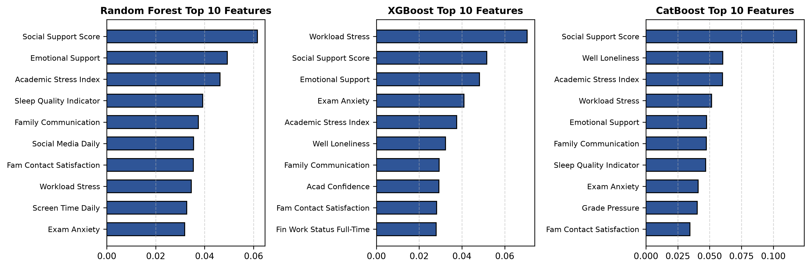
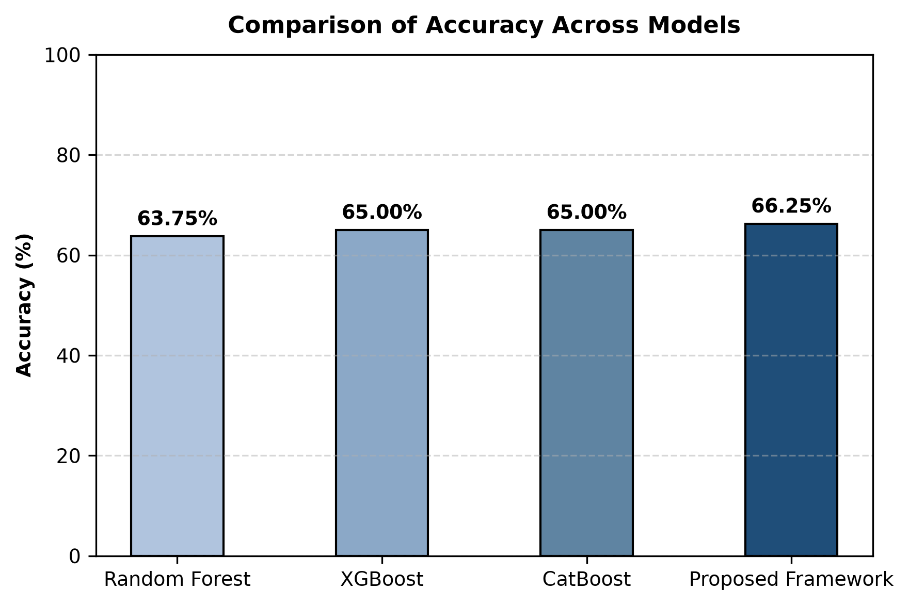
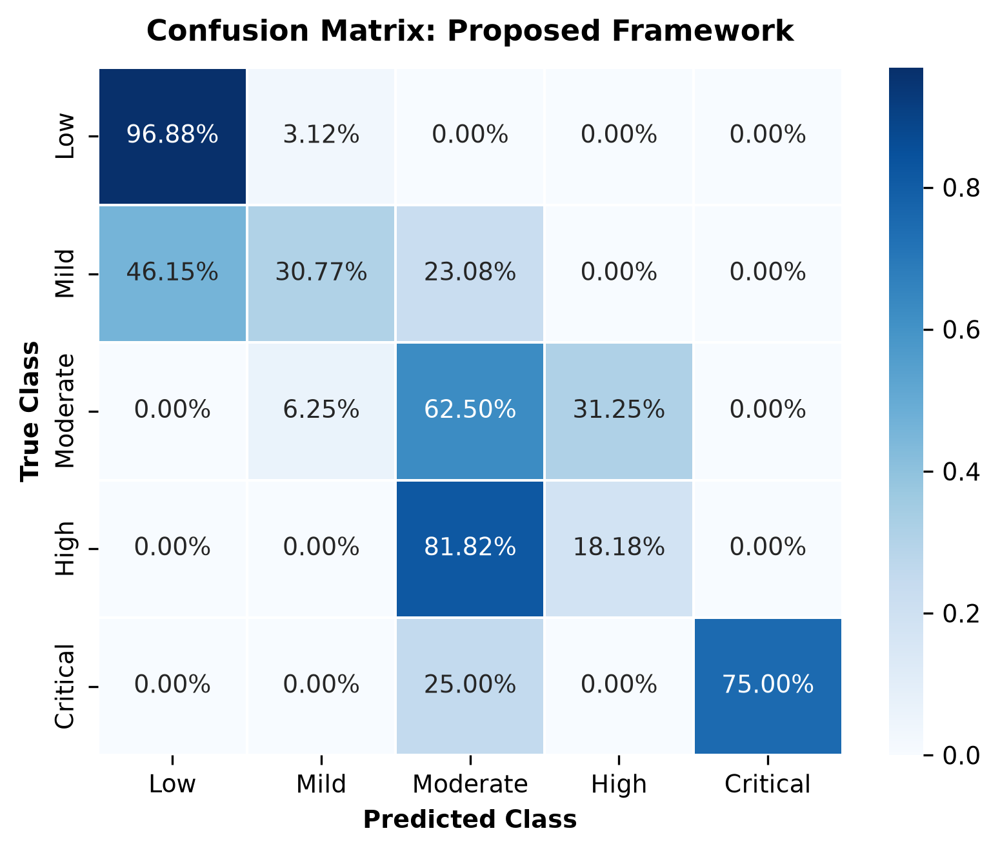

# Psychological Risk Assessment Framework for University Students

[](https://www.python.org/)
[](https://scikit-learn.org/)
[](LICENSE)

An academic machine learning framework for multi-class psychological risk level classification in university student populations. This project evaluates tree-based classifiers (**Random Forest**, **XGBoost**, **CatBoost**) and a **Soft Voting Ensemble (Proposed Framework)** operating on demographic, academic stress, lifestyle, financial, and social support indicators.

---

## 📌 Overview

University students experience multi-dimensional stressors ranging from academic workload and exam anxiety to financial worries and sleep disruptions. This project develops an end-to-end machine learning research pipeline that stratifies student psychological risk into **five ordinal categories** and provides non-clinical early warning support guidance.

---

## 🎯 Problem Statement

Traditional campus mental health screenings often rely on manual questionnaires or binary thresholding, which may fail to capture subtle multi-factor risk interactions across lifestyle, environmental, and academic domains. A multi-level risk assessment model can assist university support systems by identifying early warning risk levels prior to acute distress.

---

## 🔬 Research Objective

1. Develop a multi-class classification pipeline stratifying psychological risk into five discrete categories: **Low**, **Mild**, **Moderate**, **High**, and **Critical**.
2. Formulate 5 domain-specific composite features capturing academic stress, lifestyle quality, and social support networks.
3. Prevent target leakage by strictly excluding target-defining clinical subscale variables from model input features.
4. Apply Stratified 10-Fold Cross-Validation on the training partition ($N_{train}=320$) and evaluate performance on an untouched 20% holdout test partition ($N_{test}=80$).
5. Map predicted risk categories to structured early-warning support recommendations.

---

## 📊 Dataset

> [!IMPORTANT]
> **Synthetic Dataset Disclosure**: The dataset used in this framework ($N=400$ student cohorts across 46 variables) is **synthetic**, generated via probabilistic simulation (`data/generate_synthetic_data.py`) for research pipeline testing and algorithmic validation. It does **not** contain real clinical or student mental health records.

---

## 📐 Five-Level Risk Classification

Target risk categories (`Risk_Class`) are generated programmatically using a distress-versus-protective score balance equation:

$$\text{Distress} = \frac{\text{well\_depressive\_mood}}{3.0} + \frac{\text{well\_anxious\_mood}}{3.0} + \frac{\text{well\_loneliness}}{3.0} + \frac{\text{well\_overwhelmed}}{3.0} + \frac{\text{fam\_conflict\_stress} - 1.0}{4.0} + \frac{\text{acad\_workload\_stress} - 1.0}{4.0} + \frac{\text{acad\_exam\_anxiety} - 1.0}{4.0} + \frac{\text{acad\_grade\_pressure} - 1.0}{4.0} + \frac{\text{fin\_expense\_worry} - 1.0}{4.0} + \frac{\text{sleep\_disturbance} - 1.0}{4.0}$$

$$\text{Protective} = \frac{\text{well\_optimism}}{3.0} + \frac{\text{well\_emotional\_coping}}{3.0} + \frac{\text{fam\_communication} - 1.0}{4.0} + \frac{\text{fam\_support\_emotional} - 1.0}{4.0} + \frac{\text{fam\_contact\_satisfaction} - 1.0}{4.0} + \frac{\text{env\_belonging} - 1.0}{4.0} + \frac{\text{env\_safety} - 1.0}{4.0} + \frac{\text{phys\_stress\_relief} - 1.0}{4.0} + \frac{\text{sleep\_restfulness} - 1.0}{4.0}$$

$$r_{\text{total}} = \text{Distress} - \text{Protective}$$

### Ordinal Score Thresholds:
| Risk Class | Label | Score Threshold | Student Count ($N=400$) | Percentage |
| :---: | :--- | :--- | :---: | :---: |
| **0** | **Low Risk** | $r_{\text{total}} \le -3.0$ | 160 | 40.00% |
| **1** | **Mild Risk** | $-3.0 < r_{\text{total}} \le -2.0$ | 64 | 16.00% |
| **2** | **Moderate Risk** | $-2.0 < r_{\text{total}} \le -1.0$ | 78 | 19.50% |
| **3** | **High Risk** | $-1.0 < r_{\text{total}} \le 0.0$ | 57 | 14.25% |
| **4** | **Critical Risk** | $r_{\text{total}} > 0.0$ | 41 | 10.25% |

---

## ⚙️ Methodology

```
[Raw Survey Features (N=400)] ──► [Drop 4 Wellbeing Subscales (Leakage Prevention)]
                                           │
                                           ▼
                              [Stratified 80/20 Train-Test Split]
                                  │                         │
            ┌─────────────────────┴──────┐            ┌─────┴──────────────┐
            ▼                            ▼            ▼                    ▼
   [Train Split (N=320)]        [10-Fold CV Tuning] [Preprocessor Fit] [Holdout Test (N=80)]
            │                            │            │                    │
            └────────────────────────────┼────────────┘                    │
                                         ▼                                 ▼
                             [Soft Voting Ensemble] ────────────────► [Evaluation Metrics]
```

1. **Preprocessing**: Median imputation for numerical attributes, mode imputation for categorical attributes, `StandardScaler` for continuous feature standardization, and `OneHotEncoder` for categorical encoding.
2. **Outlier Clipping**: Training set interquartile range (IQR) boundaries ($Q1 - 3 \times IQR$, $Q3 + 3 \times IQR$) applied strictly inside pipeline transformations to prevent distribution leakage.
3. **Feature Engineering**: 5 domain-specific composite indicators:
   - **Academic Stress Index**: Average of workload stress, exam anxiety, and grade pressure.
   - **Lifestyle Score**: Composite of exercise frequency, stress relief activities, sleep restfulness, and inverted sleep disturbance.
   - **Social Support Score**: Mean of family communication, emotional support, contact satisfaction, campus belonging, and peer collaboration.
   - **Sleep Quality Indicator**: Aggregate of sleep duration, restfulness, and lack of disturbance.
   - **Behavioral Consistency Score**: Product of academic attendance rate and procrastination index.
4. **Target Leakage Exclusion**: The 4 wellbeing subscale features (`well_depressive_mood`, `well_anxious_mood`, `well_emotional_coping`, `well_overwhelmed`) are explicitly dropped from predictor inputs (45 active predictor columns total).
5. **Cross-Validation & Holdout Testing**: Stratified 10-Fold Cross-Validation on $N=320$ training samples; single final evaluation on the untouched 20% holdout test partition ($N=80$).
6. **Soft Voting Ensemble**: Combines predicted class probabilities from Random Forest, XGBoost, and CatBoost classifiers.

---

## 🤖 Machine Learning Models

- **Random Forest**: Ensembles 100 decision trees with balanced class weighting (`n_estimators=100`, `max_depth=12`, `min_samples_split=2`, `class_weight='balanced'`).
- **XGBoost**: Gradient boosted decision tree framework (`n_estimators=200`, `max_depth=3`, `learning_rate=0.2`).
- **CatBoost**: Categorical gradient boosting classifier (`iterations=200`, `depth=4`, `learning_rate=0.1`).
- **Proposed Soft Voting Ensemble**: Combines class probability vectors: $\hat{y} = \arg\max \sum_{m} P_m(y|X)$.

---

## 📈 Evaluation Metrics

Evaluated on the unseen holdout test set ($N=80$ student cohorts, 20% test split). All multi-class metrics are macro-averaged across the 5 target classes.

### Holdout Test Set Performance Table:

| Classifier Model | Accuracy | Precision (Macro) | Recall (Macro) | F1-Score (Macro) | ROC-AUC (Macro) |
| :--- | :---: | :---: | :---: | :---: | :---: |
| **Random Forest** | 63.75% | 58.42% | 56.12% | 56.53% | 85.66% |
| **XGBoost** | 65.00% | 59.10% | 55.48% | 56.29% | 85.45% |
| **CatBoost** | 65.00% | 57.38% | 53.02% | 53.08% | 87.42% |
| **Proposed Framework (Soft Voting Ensemble)** | **66.25%** | **59.88%** | **57.25%** | **57.98%** | **86.64%** |

---

## 🖼️ Results & Figures

### Figure 1: Feature Importance Analysis


### Figure 2: Model Accuracy Comparison


### Figure 3: Confusion Matrix (Proposed Framework)


---

## 💡 Recommendation Module

Predicted risk levels map to structured early-warning support suggestions:

| Predicted Risk | Action Tier | Recommendation Guidance |
| :--- | :--- | :--- |
| **Low Risk (0)** | Wellness Maintenance | Encourage healthy academic, sleep, and lifestyle habits. |
| **Mild Risk (1)** | Self-Monitoring | Suggest monitoring workload, sleep patterns, and stress management. |
| **Moderate Risk (2)** | Peer & Workshop Support | Recommend joining peer study groups and academic counseling workshops. |
| **High Risk (3)** | Academic Support Flag | Flag for early warning; recommend consultation with academic support services. |
| **Critical Risk (4)** | Professional Consultation | Immediate notification; strongly advise contacting campus counseling services. |

---

## 📂 Project Structure

```
student-psych-assessment/
├── .gitignore                  # Git ignore rules for Python/ML
├── LICENSE                     # MIT Open Source License
├── README.md                   # Publication-grade documentation
├── requirements.txt            # Python dependencies
├── main.py                     # Root CLI execution script
├── data/
│   ├── raw/
│   │   └── student_mental_health.csv
│   └── generate_synthetic_data.py
├── src/
│   ├── __init__.py
│   ├── data_preprocessing.py   # Loader, 5-class target builder, preprocessor
│   ├── feature_engineering.py  # IQR clipper & 5 composite feature engineering
│   ├── models.py               # 10-fold CV & holdout test evaluation
│   ├── recommendation.py       # Early warning mapping & report generation
│   └── pipeline.py             # End-to-end execution pipeline
├── notebooks/
│   └── 01_psychological_risk_assessment.ipynb
├── models/                     # Model directory (.gitkeep)
└── results/
    ├── figures/                # High-resolution generated plots
    └── tables/                 # Performance evaluation CSV tables
```

---

## 💻 How to Run

### Prerequisites
- Python 3.9 or higher

### 1. Clone Repository & Install Dependencies
```bash
git clone https://github.com/your-username/psychological-risk-assessment-ml.git
cd psychological-risk-assessment-ml
pip install -r requirements.txt
```

### 2. Run Main Pipeline
To execute data preprocessing, model evaluation, figure plotting, and recommendation generation:
```bash
python main.py
```

### 3. Run Interactive Jupyter Notebook
```bash
jupyter notebook notebooks/01_psychological_risk_assessment.ipynb
```

---

## 📌 Limitations

1. **Synthetic Data**: Validation is conducted on a synthetic cohort ($N=400$); real-world institutional deployment requires institutional review board (IRB) approval and empirical dataset recalibration.
2. **Sample Size**: Multi-class division across 5 risk categories results in smaller sample counts for high-risk tiers (Critical Risk = 10.25%).
3. **Lack of Clinical Diagnostic Scope**: Models predict survey-derived risk stratification indices and cannot diagnose clinical psychological disorders.

---

## ⚠️ Ethical & Clinical Disclaimer

> [!WARNING]
> **Non-Clinical Research Prototype**: This repository represents an academic research framework for early-warning risk classification and machine learning pipeline demonstration. It is **not** a clinical diagnostic tool and must **not** be used for clinical diagnosis, treatment decisions, or replacing certified mental health professionals.

---

## 🔄 Reproducibility

- **Fixed Random Seeds**: `random_state=42` is fixed across all train/test splits, cross-validation folds, and classifier initializations.
- **Relative File Paths**: All data loading, export, and figure saving routines use relative file paths.
- **Clean Execution**: Running `python main.py` in a clean environment produces identical results, CSV tables, and plots.

---

## 📜 License

This project is licensed under the [MIT License](LICENSE).
